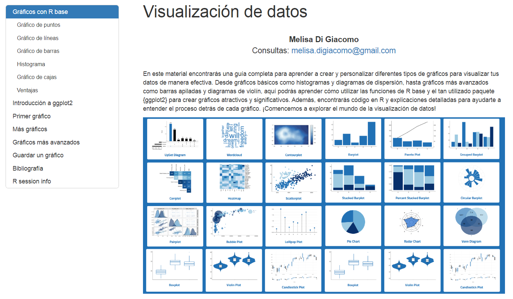
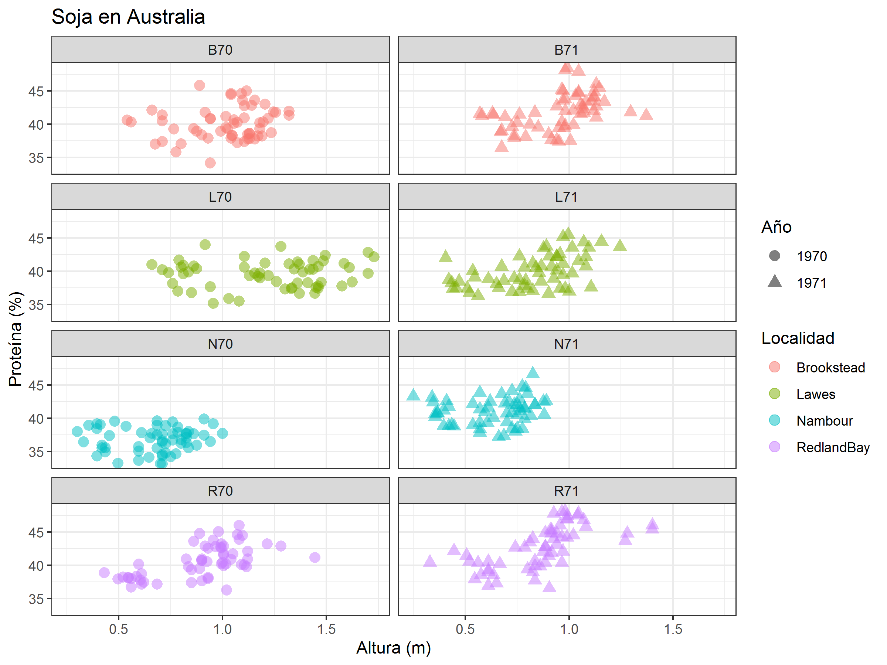

# Visualización de datos en R

En este material encontrarás una guía completa para aprender a crear y personalizar diferentes tipos de gráficos para visualizar tus datos de manera efectiva. Desde gráficos básicos como histogramas y diagramas de dispersión, hasta gráficos más avanzados como barras apiladas y diagramas de violín, aquí podrás aprender cómo utilizar las funciones de R base y el tan utilizado paquete {ggplot2} para crear gráficos atractivos y significativos. Además, encontrarás código en R y explicaciones detalladas para ayudarte a entender el proceso detrás de cada gráfico. ¡Comencemos a explorar el mundo de la visualización de datos!

## [LINK]()



## Recursos necesarios
**Versión R:** 4.2.2  
**R Studio:** 2022.12.0-353  
**Paquetes base:** stats, graphics, grDevices, utils, datasets, methods, base  
**Paquetes cargados:** ggplot2_3.4.1, agridat_1.21 

## Gráficos con R base

- Gráfico de puntos
- Gráfico de líneas
- Grafico de barras
- Histograma
- Gráfico de cajas


## Gráficos con {ggplot2}

- Gráfico de dispersión
- Gráfico de líneas
- Grafico de barras
- Histograma
- Gráfico de cajas
- Gráfico de violín
- Gráfico de barras apiladas
- Gráfico de barras agrupadas


## Datasets

Para gráficos con R base, se manejan diferentes datasets provienientes del paquete {datasets}
* `pressure`: data frame de temperatura y presión
* `BOD`: Biochemical Oxygen Demand cuenta con datos de tiempo y demanda de oxígeno 
* `mtcars`: pertenecen a Motor Trend Car Road Tests. Se utiliza la variable numérica mpg (Miles/(US) gallon).
* `ToothGrowth`: con datos de longitud de odontoblastos (células responsables del crecimiento de los dientes) medidas en 60 cobayos comparando dos métodos de administración de vitamina C, jugo de naranja (OJ) o ácido ascórbico (VC).

Para gráficos en {ggplot2} se utilizaron datos provenientes del paquete {agridat} que proporciona una amplia colección de conjuntos de datos de experimentos agrícolas provenientes de papers, libros y websites ([documentación](https://cran.rstudio.com/web/packages/agridat/agridat.pdf)).

* `australia.soybean`:
    - env: ambiente, 8 niveles, primer caracter corresponde a la localidad y últimos dos caracteres corresponden al año
    - loc: localidad, 4 niveles
    - year: año, numérico (int). En realidad son 2 niveles (1970 y 1971), debemos convertirlo
    - gen: genotipos, del G01 - G58
    - variables numéricas: rendimiento, altura, lodging, tamaño, proteínas y aceites
* `aastveit.barley.height`: datos de 9 años (1974-1982) de la altura de cebada
* `alwan.lamb`: dataset de corderos que contiene la variable categórica raza (breed) y sexo (sex), entre otras
* `pederson.lettuce.repeated`: Adataset de lechuga que posee medidas de peso (weight) de varias plantas (n = 18) en distintos días de observacion para 3 tratamientos (trt)

## Ejercitación

Vamos a obtener el siguiente gráfico siguiendo las consignas detalladas debajo:




Utilizando el dataset `australia.soybean` de {agridat}

1. Cargar los paquetes necesarios

2. Convertir la variable *year* a factor

3. Copiar el siguiente gráfico base para comenzar a trabajar:

```
ggplot(data = soybean, aes(x = height, y = protein)) +
  geom_point(size = 3, alpha = 0.5)
```

4. Dividir el gráfico en grupos/paneles en base al ambiente (*env*) y agregar *nrow = 4* para obtener 4 filas

5. Modificar los puntos de `geom_point()` con color determinado por localidad y forma, por año

6. Agregar etiquetas a los ejes:
    - Título: Soja en Australia
    - Eje x: Altura (m)
    - Eje y: Proteína (%)
    - Color: Localidad (modifica título de leyenda)
    - Shape: Año (modifica título de leyenda)

7. Modificar *theme* a `theme_bw()`

8. Guardar gráfico en png